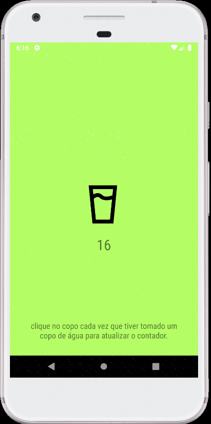

# App Drink Water :milk_glass:

Aplicativo para Android que marca quantas vezes o usuário bebeu água.

Feito em Kotlin para aplicar o uso de Intent Services e processos
assíncronos e em background.

##### Screenshot

